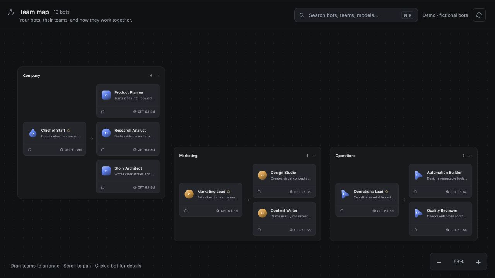

# OpenMausBot Team Map

A small, local web dashboard for visualizing your [OpenMausBot](https://github.com/milind-soni/OpenMausBot) bots as a company organigram. It follows the native app's dark canvas, team containers, mascot cards, and coordinator/member layout.



## Why a separate team map?

A solo company can have many bot roles: a chief of staff, product planning, research, marketing, content, automation, and quality review. A visual organigram makes the division of work easier to understand at a glance.

The motivating use case is an **always-on screen displaying the solo company's bot organigram**, while the native app remains available for conversations and execution. The dashboard gives the owner a persistent view of who does what, which team each bot belongs to, and which bots are working or waiting for attention. It also makes each bot's instructions and capabilities easy to inspect before assigning work.

This is an independent companion viewer. OpenMausBot remains the place to create bots, edit settings, and run conversations.

## Features

- Native-inspired dark canvas with teams, coordinators, model labels, and live activity.
- Instant local search by bot name, role/title, team, or model; accents are optional.
- Soul, Skills, and Configuration inspector, including full skill instructions and conversation setting overrides.
- Pan, zoom, fit-to-view, and draggable team containers.
- Layout saved in this browser only; moving a container does not change the native team.
- Read-only local adapter with a fictional demo mode.
- No npm build, pip packages, accounts, analytics, or external fonts.

**Chat links:** clicking the Chat icon explains the current limitation and links to [the upstream feature request](https://github.com/milind-soni/OpenMausBot/issues/2383). Direct routing to a specific native bot/chat is not implemented because the external desktop URL handler checked in OpenMausBot 0.1.96 does not support it. This dashboard does not use macOS Accessibility automation.

## Quick start on macOS

You need **Python 3.9 or newer** and a modern browser. Check Python with:

```sh
python3 --version
```

Download this repository's ZIP from **Code → Download ZIP** and extract it, or clone it with Git. Open Terminal in the extracted project directory, then run:

```sh
python3 server.py --open
```

OpenMausBot should be running on the same Mac. The dashboard opens at **http://127.0.0.1:8808** and refreshes live bot metadata every five seconds.

You can also double-click **Open Team Map.command** in Finder. If the executable bit was lost during download, restore it from Terminal:

```sh
chmod +x "Open Team Map.command"
```

Keep the Terminal window open while using the dashboard. Press **Control+C** in that window to stop it. The app is not installed as a background service.

### Try the fictional demo

No OpenMausBot installation or personal bot data is needed:

```sh
python3 server.py --demo --open
```

Demo mode never contacts OpenMausBot. The included bots, chats, souls, and skill instructions are fictional. If the native app is unavailable in normal mode, the map falls back to these demo bots; it does not save a copy of your real team.

To run a separate demo alongside an existing dashboard:

```sh
python3 server.py --demo --port 8809 --open
```

### Always-on display

Open the dashboard on the display connected to the Mac running OpenMausBot. Use your browser's full-screen mode and click the zoom percentage to fit all teams. Search stays available without a sidebar. The page resumes refreshing when it is visible again; keep the browser tab active on the display and use your normal macOS display settings if you want the screen to stay on.

## Controls

| Action | Control |
| --- | --- |
| Search | Type in the search field; **Command+K** on Mac or **Control+K** elsewhere focuses it |
| Clear search | **Escape** while the field is focused |
| Inspect a search result | **Enter** while the field is focused |
| Inspect a bot | Click its main card |
| Read a skill | Open **Skills**, then select an assigned skill |
| Move around | Drag the canvas or scroll the trackpad |
| Zoom | **+ / −** buttons, trackpad pinch, or **+ / −** with the canvas focused |
| Fit teams | Click the zoom percentage, or press **0** with the canvas focused |
| Arrange a team | Drag its header; focused headers also support arrow keys |
| Close inspector | Close button or **Escape** |

## Privacy and local data

This repository ships **only fictional demo data and a demo screenshot**. It contains no personal team snapshot, real bot IDs, private souls, conversations, API credentials, machine paths, or hosting configuration.

In live mode, the Python adapter reads OpenMausBot's loopback API at `http://127.0.0.1:8799`. It serves an explicit set of bot metadata/configuration fields and loads Soul and Skills on demand. Conversation metadata includes identifiers, titles, and execution settings; message bodies are not returned. Live data remains in server/browser memory and is not written into this repository. The only persistent dashboard state is the canvas layout in the browser's local storage, keyed by team name.

The adapter binds to `127.0.0.1`, checks Host/Origin and cross-site headers, does not enable CORS, disables caching for API responses, and only performs GET requests to OpenMausBot. It does not serve parent directories or directory listings. It requires no API key of its own.

Run the adapter locally. Do not expose it through a public proxy or change its binding to make it accessible over your network: a viewer can read private bot instructions and configuration. For public screenshots or examples, use `--demo`. Keep personal exports, secrets, and screenshots outside the repository; `.gitignore` covers common private file locations but is not a substitute for reviewing a commit.

## Compatibility and troubleshooting

The initial integration was checked against **OpenMausBot 0.1.96 on macOS**. It uses that app's local endpoints, which may change between releases; this is not a promised upstream public API contract. Python uses only its standard library. The native API port is defined in `native_json()` in `server.py`.

- **Demo bots instead of your team:** open OpenMausBot and click Refresh. Verify that its local API is available on port 8799. No credentials or conversation contents are needed for this check.
- **Inspector cannot load:** keep OpenMausBot running. Soul, Skills, and Configuration come from its local API; no personal offline snapshot is bundled.
- **Port already in use:** `--open` reuses an existing compatible dashboard. If another program or a different mode owns the port, stop that process or use `--port 8809`.
- **Python not found:** install Python 3 from [python.org](https://www.python.org/downloads/macos/) or your existing package manager, then rerun the command.
- **Unexpected layout:** browser site data stores the positions. Clearing that site's data resets the arrangement.

## Development

```text
server.py                 Read-only loopback adapter and demo server
Open Team Map.command     macOS launcher
 dist/                    Static frontend and fictional fixtures
  app.js                  Canvas, local search, inspector
  style.css               Native-inspired dark theme
  demo.json               Fictional company and inspector examples
  avatars/                Adapted OpenMausBot mascot SVGs
 docs/                    Demo screenshot
 tests/                   Privacy boundary and adapter checks
```

No build step is required. Edit the static files and refresh your browser. Restart Python after editing `server.py`.

Run the checks:

```sh
python3 -m unittest discover -s tests -v
```

If Node.js is installed, also check JavaScript syntax:

```sh
node --check dist/app.js
```

See [CONTRIBUTING.md](CONTRIBUTING.md) for contribution guidelines and [SECURITY.md](SECURITY.md) for the security model.

## License and attribution

[Apache License 2.0](LICENSE). Mascot assets derive from OpenMausBot's existing SVG body and face data; source and modifications are documented in [NOTICE](NOTICE). This repository does not bundle the native app or its other dependencies, and is not an official OpenMausBot release.
